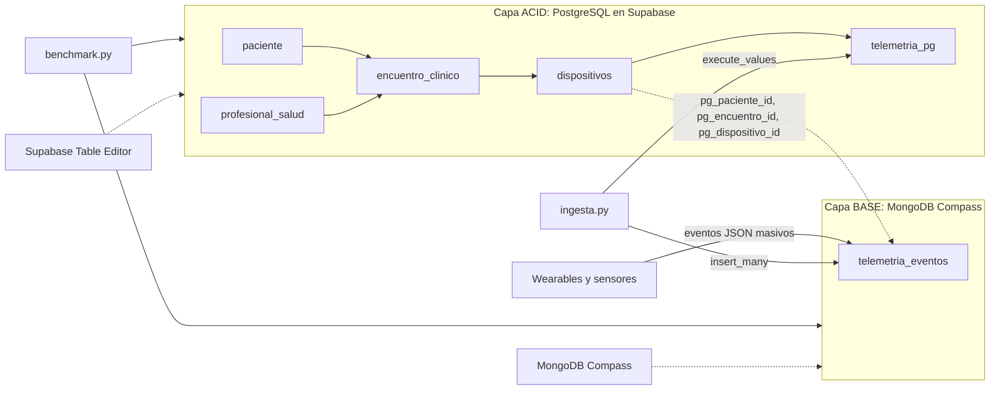

```mermaid
flowchart LR
  subgraph ACID["Capa ACID: PostgreSQL en Supabase"]
    P[paciente]
    M[profesional_salud]
    E[encuentro_clinico]
    D[dispositivos]
    T[telemetria_pg]
    P --> E
    M --> E
    E --> D
    D --> T
  end
  subgraph BASE["Capa BASE: MongoDB Compass"]
    TE[telemetria_eventos]
  end
  W[Wearables y sensores] -->|eventos JSON masivos| TE
  D -.->|pg_paciente_id, pg_encuentro_id, pg_dispositivo_id| TE
  ING[ingesta.py] -->|insert_many| TE
  ING -->|execute_values| T
  BEN[benchmark.py] --> ACID
  BEN --> BASE
  UI1[Supabase Table Editor] -.-> ACID
  UI2[MongoDB Compass] -.-> BASE
```