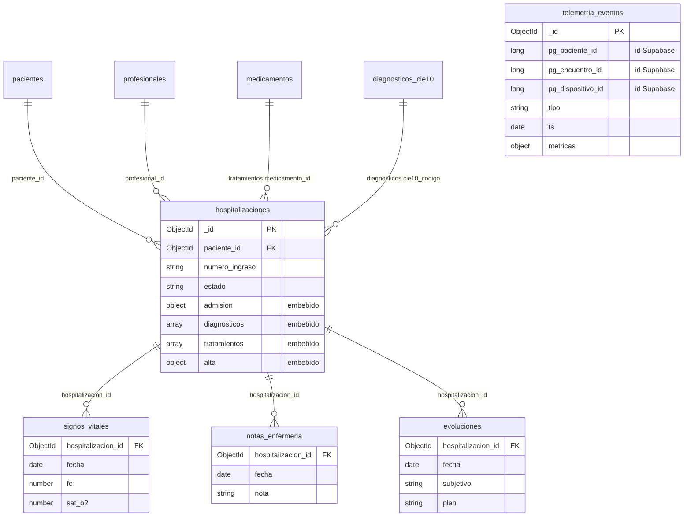

```mermaid
erDiagram
  pacientes ||--o{ hospitalizaciones : paciente_id
  hospitalizaciones ||--o{ signos_vitales : hospitalizacion_id
  hospitalizaciones ||--o{ notas_enfermeria : hospitalizacion_id
  hospitalizaciones ||--o{ evoluciones : hospitalizacion_id
  profesionales ||--o{ hospitalizaciones : profesional_id
  medicamentos ||--o{ hospitalizaciones : "tratamientos.medicamento_id"
  diagnosticos_cie10 ||--o{ hospitalizaciones : "diagnosticos.cie10_codigo"
  hospitalizaciones {
    ObjectId _id PK
    ObjectId paciente_id FK
    string numero_ingreso
    string estado
    object admision "embebido"
    array diagnosticos "embebido"
    array tratamientos "embebido"
    object alta "embebido"
  }
  telemetria_eventos {
    ObjectId _id PK
    long pg_paciente_id "id Supabase"
    long pg_encuentro_id "id Supabase"
    long pg_dispositivo_id "id Supabase"
    string tipo
    date ts
    object metricas
  }
  signos_vitales {
    ObjectId hospitalizacion_id FK
    date fecha
    number fc
    number sat_o2
  }
  notas_enfermeria {
    ObjectId hospitalizacion_id FK
    date fecha
    string nota
  }
  evoluciones {
    ObjectId hospitalizacion_id FK
    date fecha
    string subjetivo
    string plan
  }
```