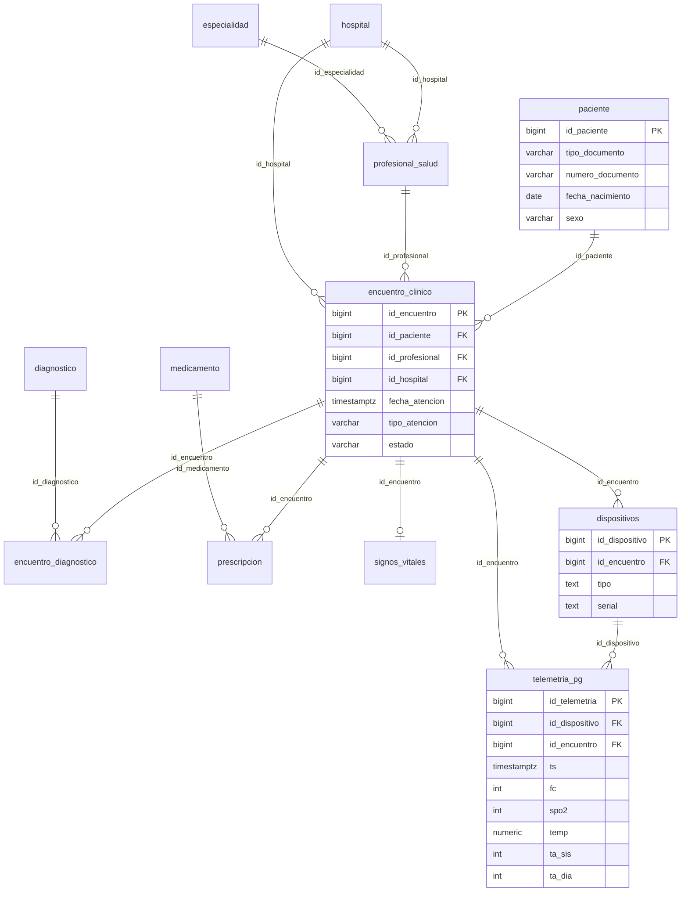

```mermaid
erDiagram
  hospital ||--o{ profesional_salud : id_hospital
  especialidad ||--o{ profesional_salud : id_especialidad
  paciente ||--o{ encuentro_clinico : id_paciente
  profesional_salud ||--o{ encuentro_clinico : id_profesional
  hospital ||--o{ encuentro_clinico : id_hospital
  encuentro_clinico ||--o{ encuentro_diagnostico : id_encuentro
  diagnostico ||--o{ encuentro_diagnostico : id_diagnostico
  encuentro_clinico ||--o{ prescripcion : id_encuentro
  medicamento ||--o{ prescripcion : id_medicamento
  encuentro_clinico ||--o| signos_vitales : id_encuentro
  encuentro_clinico ||--o{ dispositivos : id_encuentro
  dispositivos ||--o{ telemetria_pg : id_dispositivo
  encuentro_clinico ||--o{ telemetria_pg : id_encuentro
  paciente {
    bigint id_paciente PK
    varchar tipo_documento
    varchar numero_documento
    date fecha_nacimiento
    varchar sexo
  }
  encuentro_clinico {
    bigint id_encuentro PK
    bigint id_paciente FK
    bigint id_profesional FK
    bigint id_hospital FK
    timestamptz fecha_atencion
    varchar tipo_atencion
    varchar estado
  }
  dispositivos {
    bigint id_dispositivo PK
    bigint id_encuentro FK
    text tipo
    text serial
  }
  telemetria_pg {
    bigint id_telemetria PK
    bigint id_dispositivo FK
    bigint id_encuentro FK
    timestamptz ts
    int fc
    int spo2
    numeric temp
    int ta_sis
    int ta_dia
  }
```